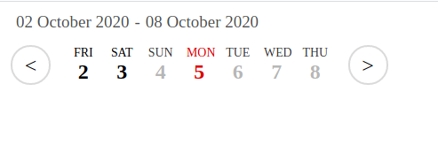

# Date Glider - JQuery plugin
> Modern & simple date slider jquery plugin.  

This plugin can be used to create a small sliding calendar like the screenshot below.  

## Installation
Installation is very simple. To install this plugin, please make sure that you are using jquery version **3.5.1 or above**. Older jquery versions may also work, but they are not tested.

## Meta

Arkodeep Ghosh – contact@ovrcraft.com

Distributed under the MIT license. See ``LICENSE`` for more information.
